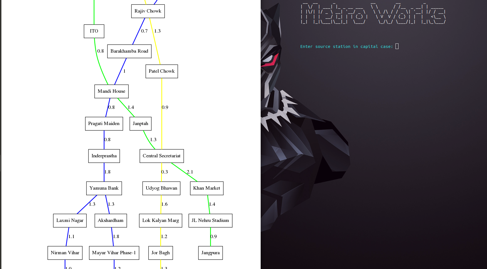
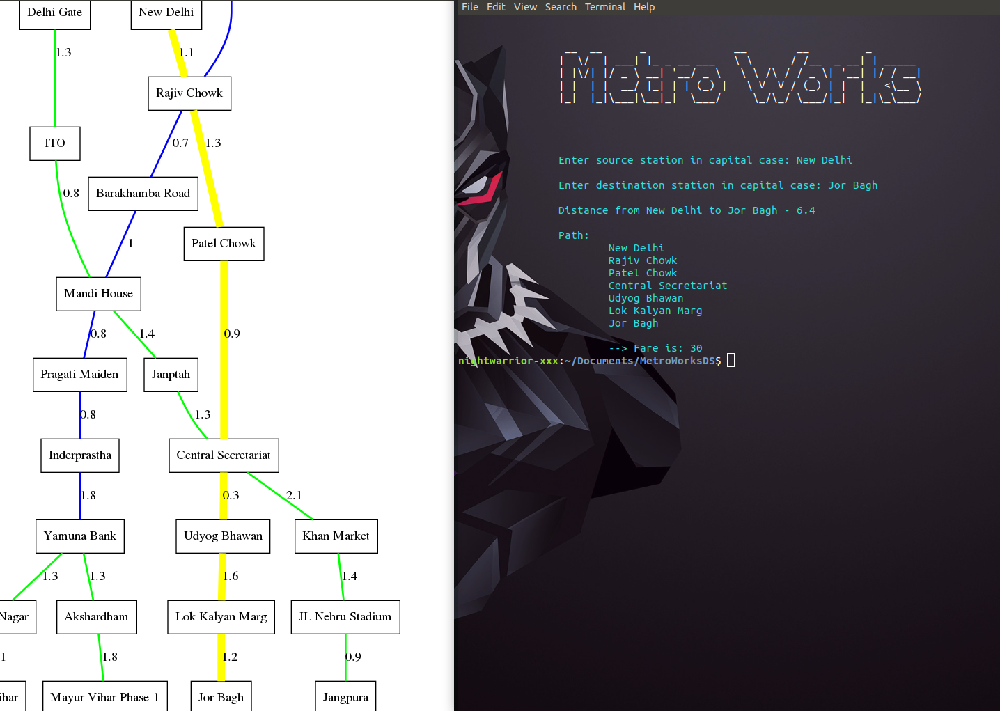
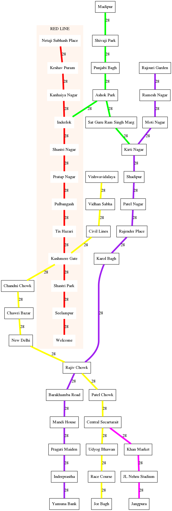

<p align="center">
  
</p>

[](https://github.com/code-monk08/metroworks/issues)  [](https://github.com/code-monk08/metroworks/network/members)  [](https://github.com/code-monk08/metroworks/stargazers)          [](https://twitter.com/intent/follow?screen_name=codemonk08_)  [](https://telegram.me/codemonk08)

## :ledger: Index

- [About](#beginner-about)
- [Usage](#zap-usage)
  - [Installation](#electric_plug-installation)
  - [Tools](#package-tools)
  - [Commands](#electric_plug-commands)
- [File Structure](#file_folder-file-structure)
- [Resources](#page_facing_up-resources)
- [Gallery](#camera-gallery)
- [Credit/Acknowledgment](#star2-creditacknowledgment)
- [License](#lock-license)

##  :beginner: About
Metroworks in an application meant for linux users, It helps you find & visualize the Shortest Path between Delhi Metro Stations, it uses Graph Data Structure & Dijkstra's Algorithm.

## :zap: Usage
To use this project.

###  :electric_plug: Installation
- Install dependencies & export environment variables.

```bash
$ sudo apt-get install graphviz 
$ sudo apt-get install fim
$ sudo apt-get install zenity
$ sudo apt-get install sl
$ sudo apt-get install notify-osd 
```
###  :package: Tools
  - [graphviz](http://www.graphviz.org/)
  - [fim](http://manpages.ubuntu.com/manpages/xenial/man1/fim.1.html)
  - [zenity](https://packages.ubuntu.com/trusty/gnome/zenity) 
  - [sl](http://manpages.ubuntu.com/manpages/trusty/man6/sl.6.html)
  - [notify-send](http://manpages.ubuntu.com/manpages/xenial/man1/notify-send.1.html) 

###  :electric_plug: Commands
- Start project using
```bash
$ g++ -std=c++11 metroworks.cpp -o metroworks
$ ./metroworks
```

##  :file_folder: File Structure
- Add a file structure here with the basic details about files, below is an example.

```
.
├── _config.yml
├── data.txt
├── fare.csv
├── Fare data
│   └── Fare Matrix Delhi Metro.xlsx
├── finalmap.dot
├── graph.png
├── graphvizdotfiles
│   ├── graph.png
│   ├── MyGraph
│   ├── path.png
│   └── StationId
├── LICENSE
├── maps
│   ├── Delhi Metro System Map.svg
│   ├── graph.svg
│   ├── id.svg
│   └── this graph test signature shape from graphviz.svg
├── metroworks.cpp
├── path.png
├── README.md
├── Report & Screenshots
│   ├── DS_MetroWork_Project.pdf
│   ├── Screenshot from 2018-11-27 03-53-27.png
│   ├── Screenshot from 2018-11-27 03-53-32.png
│   └── Screenshot from 2018-11-27 03-57-26.png
├── stations.txt
├── train1.png
└── train.png

4 directories, 25 files
```

##  :page_facing_up: Resources

- [DMRC](http://www.delhimetrorail.com/)

##  :camera: Gallery
<p align="center">
  
</p>

<p align="center">
  
</p>

<p align="center">
  
</p>

### Current Delhi Metro Stations (In our Program)
<p align="center">
  
</p>


## :star2: Credit/Acknowledgment
[](https://github.com/code-monk08/metroworks/graphs/contributors)

##  :lock: License
[](https://github.com/code-monk08/metroworks/blob/master/LICENSE)


